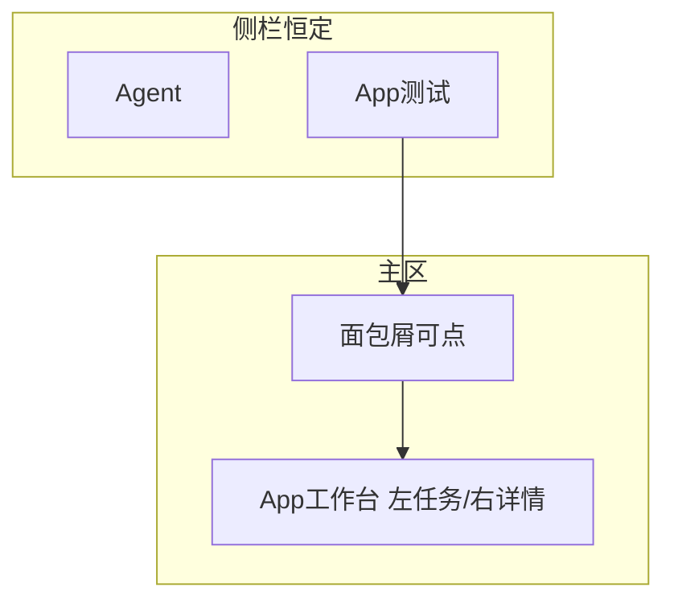

# 改进方案：App 测试导航去栈化

> 基于已落地的双工作面（Agent | App 测试），针对当前「返回列表不知所指、跳转过深」的问题做交互收敛。  
> **只改前端信息架构与页面结构；server 仍可不动。**

---

## 1. 现状问题（对照 4 张图）

| 现象 | 根因 |
|------|------|
| 侧栏出现「← 全部应用 / 返回列表」「← 造好物移动端 / 返回任务列表」 | 侧栏被当成**页面栈**，和「Agent / App 测试」主导航抢心智 |
| 「返回列表」语义不明 | 同一套文案有时回应用列表、有时回任务列表，用户要猜 |
| 应用列表 → App → 任务详情 三次整页跳 | 路由三层全页切换，上下文每次重装，像钻目录 |
| 任务详情里再套「用例 / 总结」+ 左右分栏 | 视觉层级过深：工作面 → App → 任务页 → tab → 用例 → 时间线 |
| 「新建执行」侧栏 + 工具条各一个 | 入口重复，强化「又是一个后台系统」感 |
| 任务 ID（`cr-e2f…`）当主标题 | 和应用名的关系弱，像孤立报表页 |

**一句话**：工作面切对了，但 **App 测试内部仍在用「层层进入 + 侧栏返回」**，没有「工作台」感。

---

## 2. 改进原则

1. **侧栏只切换工作面**，不承载「返回上一页」。
2. **层级只在主区面包屑表达**，每一级可点击回退；文案具体（应用名 / 任务短 ID），禁止「返回列表」。
3. **App 内最多「左列表 + 右详情」一屏完成**，任务详情不新开整页。
4. **同屏决策不超过两步**：选应用 → 在应用工作台里选任务看结果。
5. **主操作唯一**：`新建执行` 只出现在 App 工作台顶栏（未选 App 时侧栏 CTA 改为无或「选择应用」）。



---

## 3. 目标结构

### 3.1 侧栏（全程不变）

```
MiniOrange
────────────────
Agent
App 测试          ← 仅此项高亮表示工作面
────────────────
（可选）当前应用名  ← 点击弹出 App 切换器，不是「返回」
────────────────
Active · ⚙
```

- **删除**：侧栏里的「最近应用」长列表（可挪到主区应用首页）、「← 返回xxx」、当前 `cr-` 任务项。
- **当前应用**若保留：只作**切换器入口**（下拉换 App），不负责后退。

### 3.2 主区三态（同一壳，换内容不换导航语义）

#### 态 A — 未选应用：`/testing`

- 标题：App 测试
- 内容：按项目分组的应用表（现有即可）
- 操作：行点击或「进入」→ 进入态 B
- **无**侧栏返回；离开靠点 Agent 或齿轮

#### 态 B — App 工作台：`/testing/:appId`（可带 `?task=`）

```
面包屑:  App 测试  /  造好物移动端 ▾
         ↑点回态A      ↑点开 App 切换

[ 任务 ]  [ 配置 ]

顶栏唯一主按钮:  ▶ 新建执行     刷新

┌─────────────┬──────────────────────────────┐
│ 任务列表     │  未选任务：空态提示            │
│ 进度/状态/时间│  已选任务：右栏详情（见下）    │
└─────────────┴──────────────────────────────┘
```

- 点任务行 → **只更新右栏 + URL query**，不跳 `/tasks/:id` 全页。
- 「配置」仍为同页 tab（或右侧轻量抽屉）；从配置回任务 = 切 tab，不是返回栈。

#### 态 C — 任务选中（仍是态 B 的右栏，不是新页面）

右栏结构：

```
头带: [失败] 设备 · P/F/B · 进度条 · 短任务 ID
分段: ( 用例与时间线 | 总结报表 )

用例模式:
  ┌ 本任务用例列表 ┬ 选中用例时间线 ┐
  └────────────────┴────────────────┘

总结模式:
  通过率卡片 + 失败用例表（「看时间线」切回用例模式并选中该行）
```

面包屑变为：

`App 测试 / 造好物移动端 / 任务 e2f33992`

- 点「造好物移动端」→ 清空 `task` query，右栏回空态（仍在工作台）
- 点「App 测试」→ 回态 A
- **禁止**侧栏再写「返回任务列表」

---

## 4. 交互细则

| 用户意图 | 怎么做 |
|----------|--------|
| 换工作面 | 侧栏 Agent ↔ App 测试 |
| 换应用 | 面包屑 App 名 ▾，或回「App 测试」再选 |
| 看某次任务 | 工作台左栏点选；右栏展开 |
| 看总结 | 右栏内分段，不换页 |
| 看某 case 步骤 | 右栏用例列表点选 + 时间线 |
| 回到任务表 | 面包屑点应用名，或取消选中任务 |
| 新建执行 | 仅工作台顶栏；弹窗内选设备/用例；启动后左栏置顶并自动选中该任务 |

**深链**：保留 `?task=cr-xxx`（可选 `case=`），刷新可恢复；旧 `/testing/:appId/tasks/:taskId` **redirect** 到带 query 的工作台。

---

## 5. 文案与视觉约束

- 不用「返回列表 / 返回任务列表 / 不知名返回」。
- 面包屑用实体名：应用名、任务短 ID（后 8 位即可，hover 显示全量）。
- 侧栏 CTA：未选 App 时隐藏「新建执行」或改为「去选应用」；选中 App 后与顶栏二选一（**推荐只留顶栏**）。
- 任务列表主列优先：`时间 + 状态 + 进度`，`cr-` ID 降为次要信息。

---

## 6. 与当前实现的映射（改什么）

| 现状 | 改进 |
|------|------|
| [AppList.vue](MiniOrange/src/views/Testing/AppList.vue) 侧栏「最近应用」 | 侧栏清空上下文列表；最近应用可做主区次要区块（可选） |
| [AppShell.vue](MiniOrange/src/views/Testing/AppShell.vue) 整页任务表 | 改为左右主从；任务选中写 `route.query.task` |
| [TaskDetail.vue](MiniOrange/src/views/Testing/TaskDetail.vue) 独立全页 | **并入 AppShell 右栏**（组件化 `TaskDetailPane`）；路由 redirect |
| [WorkShell.vue](MiniOrange/src/layouts/WorkShell.vue) 侧栏 slot 塞返回项 | 侧栏 slot 仅保留「当前 App 切换器」或空 |
| 双「新建执行」 | 删除侧栏 CTA，只留工作台顶栏 |

---

## 7. 成功标准

- 从进入 App 测试到看完失败步骤：**侧栏主导航文案不变**，只高亮「App 测试」。
- 任意时刻用户能回答「我在哪」：看主区面包屑即可，不依赖侧栏返回链。
- 回退路径唯一：面包屑向上点，无需学习「返回列表」指哪一层。
- 任务/总结/时间线切换无整页闪烁（同工作台内更新）。

---

## 8. 分期

- **P0（交互收敛）**：✅ 面包屑 + App 工作台主从；TaskDetail 并入右栏；去掉侧栏返回栈与重复新建；旧 task 路由 redirect。
- **P1**：App 切换器下拉；任务列表信息降噪（短 ID、突出进度）；总结/用例分段动效打磨。
- **P2（可选）**：未选 App 时的全局「进行中任务」条；配置也改为工作台内嵌而非跳 Settings（若仍觉跳转重）。
