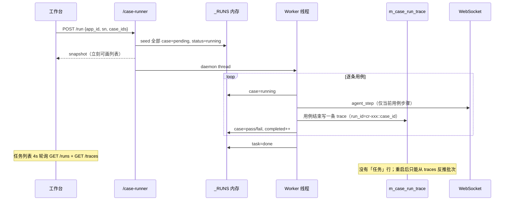
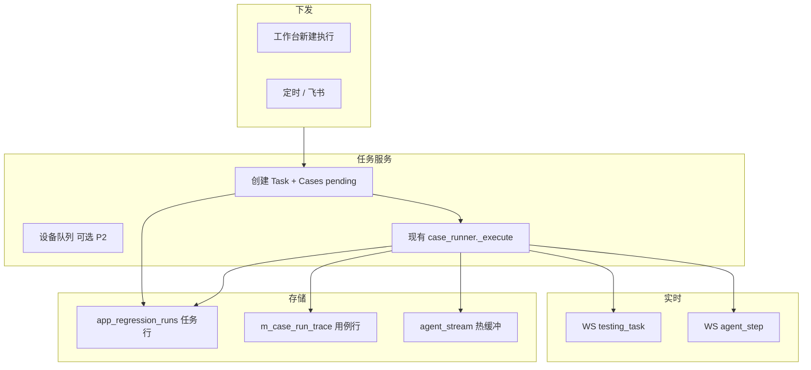

# 测试平台方案：任务下发 · 进度 · 用例状态

> 日期：2026-08-14  
> 对照现状：前端 MiniOrange **0.0.101** / 后端 MiniOrangeServer **0.0.102**  
> 已落地 IA：`docs/prd_testing_workspace_v3.md`、`docs/prd_testing_nav_flatten.md`、`docs/changelog_testing_workspace.md`  
> 执行引擎：`MiniOrangeServer/docs/prd_llm_agent_execution.md`（Agent 闭环，本文不重做引擎）

本文回答三件事：

1. **一次测试从下发到结束，系统里到底发生什么**（任务 / 用例 / 步骤）。
2. **现有页面缺什么、改什么、加什么**（不推倒重来）。
3. **后端如何从「内存拼装」升级成可查询、可恢复、可实时推送的任务中心**。

**给其他 Agent：** 先读 **§0 仓库与并行规则** 和 **§12 工作包清单**（含接口契约、改哪些文件、依赖、完成标准）。产品背景在 §1–§11。不要重做 Agent 执行引擎，不要改测试侧栏 IA。

---

## 0. 仓库与并行规则

| 角色 | 仓库 | 不要动 |
|------|------|--------|
| **后端 Agent** | `/Users/changpengcheng/code/MiniOrangeServer` | `planner` / `AgentExecutor` 决策循环；前端 Vue |
| **前端 Agent** | `/Users/changpengcheng/code/MiniOrange` | Python；不要新开整页任务详情路由 |

**可并行：** 后端先把 §12.1 的 JSON 契约（含 mock 示例）写进 `rCaseRunner.py` 的 docstring 或本文件；前端可按契约 mock。P0 后端 `BE-P0-1~4` 与前端 `FE-P0-1`（normalize + api 封装）可同时开工；`FE-P0-2` 换列表数据源须等 `GET /tasks` 可调（或本地 mock）。

**状态枚举（前后端必须一致，禁止各自发明同义词）：**

- Task：`queued` | `running` | `done` | `failed` | `cancelled`
- Case：`pending` | `running` | `pass` | `fail` | `blocked` | `declined` | `skipped` | `cancelled`
  - `hitl` **不是**独立 status：用例仍为 `running`，另给 `hitl: true` 或 `waiting: hitl`
- 前端展示「失败」用 `fail`；旧数据 `failed` 仅作兼容别名，normalize 时收成 `fail`

**任务 JSON 形状（列表项 = 详情，详情多 `cases[]`）：**

```json
{
  "task_id": "cr-4d3429901ceb",
  "app_id": "app-xxx",
  "app_name": "造好物移动端",
  "run_type": "manual",
  "sn": "5fda2f6d",
  "platform": "android",
  "status": "running",
  "total": 3,
  "completed": 1,
  "passed": 1,
  "failed": 0,
  "blocked": 0,
  "declined": 0,
  "progress": 33,
  "pass_rate": 100,
  "error": "",
  "provider_name": "火山引擎",
  "model_name": "doubao-seed",
  "started_at": "2026-08-14T10:00:00",
  "finished_at": null,
  "busy": true,
  "current_case_id": "row-59",
  "cases": [
    {
      "case_id": "row-59",
      "name": "评论",
      "status": "running",
      "report_run_id": "cr-4d3429901ceb::row-59",
      "summary": "",
      "elapsed_ms": 0,
      "started_at": "2026-08-14T10:00:10",
      "hitl": false
    }
  ]
}
```

列表接口可省略 `cases` 或只带摘要；详情必须带全量 `cases`（长度 = `total`）。

---

## 1. 产品对象（先把词对齐）

| 对象 | 现在实际是什么 | 平台应把它当成什么 |
|------|----------------|--------------------|
| **应用 App** | 项目下的被测包（飞书用例挂在 App 上） | 测试工作台的容器；任务永远属于某个 App |
| **任务 Task** | `cr-xxxxxxxxxxxx` 内存 batch（`_RUNS`）；重启即丢 | **一次下发 = 一条任务**：勾选的多条用例 + 一台设备 + 一次触发 |
| **用例 Case** | 飞书表格一行；执行时 `cr-xxx::case_id` | 任务下的子项，有独立生命周期 |
| **步骤 Step** | Agent `agent_step` / `EventResult` | 用例内的动作时间线（已有 ExecutionTimeline） |
| **设备 Device** | `/case-runner/devices` 在线可执行通道 | 任务占用资源；同一 SN 同时只跑一个任务（先约束，后可排队） |

状态机建议（前后端共用同一套枚举）：

```
任务 Task
  queued → running → done | failed | cancelled
                 ↘ paused（P2）

用例 Case
  pending → running → pass | fail | blocked | declined | skipped | cancelled
            ↘ hitl（等待人工，仍算 running 的子态）
```

前端 `testingTasks.js` 已接近这套词，但 **queued / cancelled / skipped / hitl** 尚未一等公民。

---

## 2. 现状：一条任务实际怎么走



### 已有、可用的能力

- **下发**：`POST /case-runner/run`（异步、seed pending、设备闸门、无模型则整单失败）。
- **内存进度**：`GET /case-runner/run/{id}`、`GET /case-runner/runs`（含 `cases[]` pending/running/done）。
- **历史用例**：`GET /case-runner/traces`、详情含 `event_results` + thumb。
- **步骤实时**：WS `agent_step` + `GET /case-runner/agent/steps/{run_id}` 回填。
- **工作台**：App 列表 → 任务轨 → 详情（用例轨 + 时间线 + 总结）→ 同壳配置；新建执行弹窗。
- **HITL**：全局弹窗 + 详情琥珀色条。

### 结构性缺口（平台级，不是 UI 微调）

| 缺口 | 后果 |
|------|------|
| 任务只在进程内存 `_RUNS` | 重启后任务列表只能靠 traces **反推**，看不到当时 pending、设备、模型、未跑完的用例 |
| `AppRegressionRun` 表已存在，**case_runner 没用它** | 飞书旧链路会 `persist_run_progress`，AI-led 新链路不落任务行 |
| traces **没有 app_id** | 前端用「当前 App 的 case_id 集合」过滤，用例表空时历史任务全部消失 |
| 任务级进度靠 **4 秒 HTTP 轮询** | 列表/详情延迟；WS 只推步骤不推「用例切换 / 任务完成」 |
| `GET /runs` **不能按 app_id 过滤** | 多 App 混在内存列表里，前端再筛 |
| 没有取消 / 重跑失败项 / 占用设备 | 误点只能等跑完；设备被占无提示 |
| 定时/飞书自动触发未进新工作台 | 「任务」心智不完整，只有手工「新建执行」 |
| traces `limit` 偏小 + 按时间切 | 大批次后段用例进不了聚合 |

一句话：**执行引擎已经能跑，任务中心还不是一等数据。** 页面再打磨也补不了重启丢失和跨 App 查询。

---

## 3. 目标架构

把「任务」做成持久对象，用例挂在任务下，步骤仍走现有 Agent 流。内存 `_RUNS` 只作 **热缓存**（正在跑的快照），权威在 DB。



### 3.1 任务记录（扩展现有 `app_regression_runs`）

不必新表也能起步。建议字段（缺的放 `payload` JSON，稳定后再 ALTER）：

```
run_id          cr-xxx                  PK（与现内存 run_id 一致）
app_id          应用
run_type        manual | feishu | schedule
sn / platform
status          queued | running | done | failed | cancelled
total / passed / failed / blocked / declined / completed
provider_id / model_name
error
payload         {
                  cases: [{ case_id, name, status, report_run_id, summary, elapsed_ms, started_at }],
                  connectivity, package, env_profile
                }
started_at / finished_at
```

`run_id` 列现在是 `String(32)`，`cr-` + 12 hex = 15 字符，够用。

### 3.2 用例记录

继续用 `m_case_run_trace`，**不要再为每个 case 新建一张表**。补三件事：

1. `run_context` 或独立列写入 **`batch_id`（任务 id）+ `app_id`**（创建 pending 行时就可以写，不必等跑完）。
2. 开跑即 insert/upsert 一条 `overall_status=pending|running` 的 trace（或轻量 `m_task_case` 索引表，二选一；推荐 **upsert trace**，少一张表）。
3. 列表 API 按 `app_id` / `batch_id` 查，而不是前端猜。

### 3.3 实时事件（任务级）

新增 WS 类型 `testing_task`（与 `agent_step` 并列），payload 小、可丢可补：

```json
{
  "type": "testing_task",
  "data": {
    "event": "task_created | case_running | case_finished | task_finished | hitl | cancelled",
    "task_id": "cr-xxx",
    "app_id": "...",
    "status": "running",
    "completed": 1, "total": 5,
    "case": { "case_id": "row-59", "status": "running", "report_run_id": "cr-xxx::row-59" }
  }
}
```

前端：任务列表 / 详情 **订阅该事件增量更新**；步骤区继续订 `agent_step`。轮询降为 **兜底 15–30s** 或窗口重新可见时拉一次。

---

## 4. 主链路：下发 → 进度 → 用例 → 步骤

### 4.1 任务下发

**现在**：弹窗选设备 + 多选用例 → `POST /run` → `replaceQuery({ task: batch })`。

**保持**：入口仍是 App 壳「新建执行」，App 已锁定，不重选应用。

**增加 / 修改**：

| 项 | 改法 |
|----|------|
| 提交前校验 | 设备在线、通道可执行、模型已配（已有文案）；**增加「该 SN 是否已有 running 任务」** |
| 返回 | 仍返回 `run_id`；同时 DB 已有任务行，刷新不怕丢 |
| 提交后 | 立刻进详情（已有）；列表插入该任务置顶，状态 running，用例全 pending |
| 触发源 | payload `run_type=manual`；后续定时/飞书走同一创建函数，仅 `run_type` 不同 |
| 失败即可见 | 设备闸门失败：任务 `failed`，**所有 pending 用例标 fail**（现已有），详情能解释原因 |

可选 P1：下发页展示「将跑 N 条 / 预计占用设备 / 执行模型」，避免点完才发现没模型。

### 4.2 任务进度

**现在**：内存 `completed/total` + 4s 轮询；历史任务 traces 聚合后 `progress` 常为 100%（因为只有已结束的 case）。

**目标展示**（任务行 + 详情头，不改视觉语言）：

```
状态徽章 | 短ID | 设备 | P/F/B | completed/total | 通过率 | 窄进度条
运行中：当前用例名（如 row-59）一句话
```

**数据规则**：

- `total` = 下发时锁定的用例数（seed），中途不因 traces 漏拉而变少。
- `completed` = 终态用例数（pass/fail/blocked/declined/skipped/cancelled）。
- `progress%` = completed/total。
- 历史任务从 **任务表** 读这些计数，不再用 traces.length 当 total。

### 4.3 单个用例执行状态

**现在**：live 时内存 `cases[]`；结束后靠 traces；详情左侧轨 + 自动选中 running。

**目标**：

| 状态 | 列表怎么表现 | 点进去 |
|------|--------------|--------|
| pending | 灰点，无时间线 | 空态：「排队中，当前正在跑 xxx」 |
| running | 绿脉冲（已有） | 实时时间线（已有 WS） |
| hitl | 琥珀点 + 详情横幅 | 时间线停在 ask_human；引导去弹窗 |
| pass/fail/blocked | 现有色条 | 回放时间线 + 总结 |
| skipped / cancelled | 灰/中性 | 原因文案 |

用例行建议字段（详情轨已接近，补齐即可）：`status, summary, elapsed_ms, started_at, current_step`。

`current_step` 可由最近一条 `agent_step` 冗余到任务 payload，列表不必拉步骤流。

### 4.4 步骤（基本不动）

ExecutionTimeline + thumb + 水瀑分色已落地。平台层只保证：

- 用例 `report_run_id` 稳定为 `task_id::case_id`。
- 结束时 `elapsed_ms` / thumb 写入 trace（0.0.102 已做 assert_goal）。
- 历史回填优先 `agent/steps`，否则 `event_results`。

---

## 5. 页面：在现有工作台上加什么、改什么

原则：**不新增第三套导航**。仍是 全部应用 → App 工作台（任务 | 配置）→ 任务详情同屏。

### 5.1 `/testing` 全部应用（`AppList.vue`）— 小改

| 现状 | 建议 |
|------|------|
| 项目分组卡片进 App | 保留 |
| 看不到这个 App 最近是否在跑 | 卡片角标：`运行中 n` / 上次通过率（读任务表按 app 聚合，P1） |

侧栏项目过滤保持。不在首页堆任务列表（任务属于 App）。

### 5.2 `/testing/:appId` 任务列表（`AppShell.vue`）— 主改数据，辅改交互

**改**

- `loadTasks`：改为 `GET /case-runner/tasks?app_id=`（见 §6），**去掉** runs+traces 前端聚合（或聚合仅作过渡期 fallback）。
- 运行中任务用 `testing_task` 更新进度条，不必 4s 全量刷新整表。
- 任务行增加：触发类型（手工/飞书/定时）、占用设备、失败时一行 error。
- 「该设备忙碌」：新建执行下拉禁用或标注「执行中 cr-xxxx」。

**加（P1）**

- 筛选：状态（运行中 / 失败 / 全部）、时间。
- 操作：取消运行中任务；失败任务「重跑失败用例」（新任务，case_ids=失败集）。
- 空态区分：「从未跑过」vs「服务重启、旧数据在迁移」。

**不加**

- 不要再做整页任务详情路由；继续 `?task=` 同壳。

### 5.3 任务详情（`TaskDetailPane.vue`）— 主改实时与终态一致性

**改**

- `loadTask`：优先 `GET /case-runner/tasks/{id}`（含完整 `cases[]`）；内存 GET `/run/{id}` 仅当任务仍 running 且需要更热的快照。
- 用例轨数据与任务表一致，避免 live 一套、历史一套。
- 订阅 `testing_task`：`case_running` 自动选中；`case_finished` 更新徽章；`task_finished` 停轮询、拉总结。

**加**

- 头带「取消任务」（running）。
- 单条失败用例：「只重跑这一条」（创建 total=1 的新任务，或挂到原任务的 retry 子记录——P1 建议 **新任务更简单**）。
- 总结报表：失败表已有；补「未执行（cancelled/pending 因任务失败）」分组。

### 5.4 时间线（`ExecutionTimeline.vue`）— 基本不改

只接数据：pending 不挂组件；running 开 `live`；结束 `live=false` 再 backfill 一次防漏事件。

### 5.5 配置（`AppConfigPage` 嵌入）— 不改结构

用例来源（飞书抓取）仍在配置。下发弹窗继续读缓存用例列表。P2：配置里标明「最近同步时间 / 条数」，避免下发列表过期。

### 5.6 HITL（`GlobalHitlDialog`）— 小改

已有全局弹窗。平台层：`testing_task` 的 `hitl` 事件同时点亮任务行 + 用例轨，避免只看到弹窗看不到是哪条任务。

### 5.7 不建议新开的页面

- 全局「所有 App 的任务」大表（和 App 心智冲突；最多 P2 在设置里做运维检索）。
- 独立「设备占用看板」（先在新建执行和下拉里提示即可）。

---

## 6. 后端如何支持

### 6.1 API（在 `/case-runner` 上演进，避免新前缀）

| 方法 | 路径 | 作用 | 相对现状 |
|------|------|------|----------|
| POST | `/run` | 下发 | **改**：落任务行 + seed cases + 广播 `task_created`；忙碌设备 409 |
| GET | `/tasks` | `?app_id=&status=&limit=` | **新**（替代前端拼 `/runs`+`/traces`） |
| GET | `/tasks/{task_id}` | 任务+cases 快照 | **新**；running 可合并内存 |
| POST | `/tasks/{id}/cancel` | 取消 | **新**：worker 设 flag，当前 case 标 cancelled，剩余 pending→cancelled |
| POST | `/tasks/{id}/retry-failed` | 重跑失败项 | **新**：内部再调 run，新 task_id |
| GET | `/run/{id}` `/runs` | 内存热快照 | **保留**一段时间；`/runs` 增加 `app_id` |
| GET | `/traces` | 用例历史 | **改**：支持 `app_id`、`batch_id`；`run_context` 带 app_id |
| GET | `/traces/{run_id}` | 步骤详情 | 保留 |
| WS | `testing_task` | 任务/用例进度 | **新** |
| WS | `agent_step` | 步骤 | 保留 |

`POST /run` 响应保持兼容：`{ run_id, status, total, cases }`，前端几乎不用改提交代码。

### 6.2 case_runner 改动点（最小侵入）

现有 `_execute` 循环已 upsert case、completed++。插入持久化即可：

1. `run_cases` 创建 `run_doc` 后调用现成 `persist_run_start`（`run_type=manual|...`），并把 `payload.cases = seeded_cases`。
2. `_upsert_case` / `_mark_case_running` 后 `persist_run_progress`（飞书链路已有函数，AI-led 复用）。
3. 每条 case 开始：upsert `m_case_run_trace` 为 running（`run_id=cr-xxx::case_id`，context 含 `batch_id/app_id`）。
4. 每条 case 结束：现有写 trace 逻辑保留，并更新任务计数。
5. 循环头检查 `cancel_flag`。
6. 每次任务/用例状态变化 `broadcast testing_task`。

不要把 AgentExecutor 和任务表耦合；任务服务只包一层。

### 6.3 Worker 与取消

当前是 `threading.Thread(daemon=True)`，没有取消。P0 可用 `run_doc["_cancel"] = True`，在 **case 边界** 退出（不强杀正在 dispatch 的一步，避免设备悬空）。P2 再考虑步骤级中断。

### 6.4 设备占用

`GET /devices` 增加 `busy_task_id`（扫 running 任务的 sn）。下发时若 sn 已 busy → 409，前端弹「去查看该任务 / 仍要排队」（排队 P2）。

### 6.5 定时与飞书

创建任务走 **同一个 `run_cases()`**。飞书/定时只多 `run_type` 和触发元数据。工作台任务行用小标签区分来源，详情不需要第三种布局。

旧 `/feishu/run` 可逐步 redirect 或内部转调 case_runner，避免两套进度模型。

---

## 7. 前端数据层改造（对应页面）

建议收敛到一个 composable，避免 AppShell / TaskDetailPane 各拉各的：

```
useTestingTask(appId)
  list[]          来自 GET /tasks
  applyWsEvent()  testing_task 增量
  createRun()     POST /run
  open(taskId)

useTestingTaskDetail(taskId)
  task + cases
  selectCase / live flag
```

`testingTasks.js` 的 `normalizeMemoryRun` 可改名为 `normalizeTask`，同时吃任务 API 与旧 snapshot，过渡期兼容 `/runs`。

---

## 8. 分期

### P0 — 任务成为真数据（平台能站住）

1. case_runner 写入 / 更新 `app_regression_runs`。
2. `GET /tasks?app_id=`、`GET /tasks/{id}`；工作台列表/详情改走新接口。
3. trace 写入 `app_id` + `batch_id`；traces 查询可按 App。
4. WS `testing_task`；前端 running 任务增量更新，轮询降频。
5. 设备 busy 检测 + 下发 409。

**验收**：杀后端进程再开，该 App 下仍能看到完整任务（含当时 total 与每条用例终态）；运行中刷新页面进度不丢。

### P1 — 可控

6. 取消任务（case 边界）。
7. 重跑失败用例 / 单条重跑（新任务）。
8. 应用卡片运行中角标。
9. 任务列表筛选；HITL 与任务行联动。
10. 新建执行展示占用与模型闸门。

### P2 — 调度

11. 同设备排队 queued。
12. 定时任务在工作台可见（run_type=schedule）。
13. 步骤级中断；多设备并行同一 App（需产品确认设备分配）。
14. 全局运维检索（跨 App 任务，放设置而非测试侧栏）。

---

## 9. 明确不做（本阶段）

- 重做 Agent 决策循环（已在 agent 方案里）。
- 把任务做成独立于 App 的一级导航。
- 用前端继续「永远聚合 traces」当长期方案。
- 为水瀑/胶片再开一张「性能专用页」（留在用例时间线即可）。

---

## 10. 建议自测（P0 完成后）

- [ ] 新建执行 3 条用例：列表立刻 0/3，第一条 running，后两条 pending。
- [ ] 跑到一半刷新：仍是同一 task_id，进度连续。
- [ ] 重启 server：已结束任务仍在该 App 下，total 不是「traces 条数」。
- [ ] 换一个没有这些 case_id 的过滤条件也不该让任务消失（按 app_id 存）。
- [ ] 设备正在跑时再对同一 SN 下发：被拒绝并给出跳转。
- [ ] 运行中 WS 断线再连：轮询或重拉 `/tasks/{id}` 能对齐。
- [ ] 点进 running 用例仍有实时步骤；结束后 thumb/耗时可回放。

---

## 11. 和现有文档的关系

| 文档 | 关系 |
|------|------|
| `prd_testing_workspace_v3.md` | IA / 壳 / 面包屑 — **继续有效**，本文不改导航哲学 |
| `prd_testing_nav_flatten.md` | 去栈、同屏详情 — **继续有效** |
| `changelog_testing_workspace.md` | 已落地 UI/时间线 — 本文在其之上补 **任务数据平面** |
| `prd_llm_agent_execution.md` | 单用例怎么跑 — 本文只消费其事件与 trace |

**下一步若开工**：后端 `BE-P0-1` + 前端 `FE-P0-1` 同时起；列表切流等 `GET /tasks`。

---

## 12. 工作包清单（按 Agent 拆分）

每个包：`ID` / 仓库 / 改哪些文件 / 依赖 / 完成标准。未列文件尽量别改。P0 必须按依赖做完才能联调。

### 12.1 共享契约（后端先定稿，前端遵守）

**HTTP 前缀** 仍是 `/case-runner`。

| 方法 | 路径 | 后端 | 前端 |
|------|------|------|------|
| POST | `/run` | 落库 + 409 busy；body 可加 `run_type`，默认 `manual` | 处理 409；成功仍用 `data.run_id` |
| GET | `/tasks` | **新** `app_id` 必填；`status, limit, offset` | 任务列表唯一数据源 |
| GET | `/tasks/{task_id}` | **新**；running 时内存覆盖 DB | 详情唯一数据源 |
| POST | `/tasks/{id}/cancel` | P1 | 详情「取消」 |
| POST | `/tasks/{id}/retry-failed` | P1；返回新 `task_id` | 「重跑失败」 |
| GET | `/runs` | 加 `app_id`（过渡） | P0 之后不再作为列表主源 |
| GET | `/devices` | 每项加 `busy_task_id` | 新建执行禁用/提示 |
| GET | `/traces` | 加 `app_id`、`batch_id` | 仅排查/兼容，不拼任务 |

**GET `/tasks` 响应：**

```json
{ "ok": true, "data": { "items": [ "/* 任务 JSON，cases 可省略 */" ], "total": 32 } }
```

**GET `/tasks/{id}` 响应：** `{ "ok": true, "data": { /* 完整任务 JSON */ } }`

**POST `/run` 409：** 推荐 `HTTPException(status_code=409, detail={"message":"device busy","busy_task_id":"cr-xxx"})`。后端选定后写进 `rCaseRunner.py` 注释，前端按同一种解析。

**WS `testing_task`：**

```json
{
  "type": "testing_task",
  "data": {
    "event": "task_created | case_running | case_finished | task_finished | hitl | cancelled",
    "task_id": "cr-xxx",
    "app_id": "...",
    "status": "running",
    "completed": 1,
    "total": 3,
    "passed": 1,
    "failed": 0,
    "blocked": 0,
    "declined": 0,
    "progress": 33,
    "current_case_id": "row-59",
    "case": {
      "case_id": "row-59",
      "status": "running",
      "report_run_id": "cr-xxx::row-59",
      "summary": "",
      "hitl": false
    }
  }
}
```

广播通道与现有 `agent_step` 相同（`DeviceManager.broadcast_to_observers`）。前端用现有 `addMessageListener`，判断 `res.type === 'testing_task'`。

---

### 12.2 后端工作包（MiniOrangeServer）

#### BE-P0-1 任务落库

- **做：** `run_cases` 创建 `run_doc` 后调用 `persist_run_start`；`_upsert_case` / `_mark_case_running` / 终态后调用 `persist_run_progress`；`run_type` 写入 `AppRegressionRun`（`manual`）。闸门失败、无用例、worker 崩溃都要落终态。
- **文件：** `server/services/regression/case_runner.py`；复用 `server/services/app_automation_service.py` 的 `persist_run_start` / `persist_run_progress`（可小改以写入 `payload.cases`、`completed`、`blocked`、`error`）。必要时扩 `server/models/app_regression_run.py` 的 `payload`，能不 ALTER 就不 ALTER。
- **依赖：** 无。
- **完成：** 跑完一条任务，DB `app_regression_runs` 有该 `run_id`；重启进程仍能读到。

#### BE-P0-2 任务查询 API

- **做：** `GET /tasks?app_id=`、`GET /tasks/{task_id}`。实现：DB 行 → 任务 JSON；若内存 `_RUNS` 有同 id，用内存覆盖进度与 `cases`。按 `started_at` 倒序。
- **文件：** `server/routers/rCaseRunner.py`；建议新模块 `server/services/regression/task_store.py`（避免 router 堆 SQL）。
- **依赖：** BE-P0-1。
- **完成：** curl 按 `app_id` 列出；详情 `cases.length === total`；无 app_id 返回 400。

#### BE-P0-3 Trace 带 app_id / batch_id

- **做：** 写 `m_case_run_trace` 时 `run_context` 含 `app_id`、`batch_id`（任务 id）。case **开始**即可 upsert pending/running 行。`GET /traces` 增加 `app_id`、`batch_id` 过滤。
- **文件：** `server/services/regression/case_runner.py`；`server/services/regression/case_memory/repo.py`；`rCaseRunner.py` query 参数。
- **依赖：** 无（可与 BE-P0-1 并行）。
- **完成：** 新跑 trace 的 `run_context.app_id` 有值；`?batch_id=cr-xxx` 只返回该任务用例。

#### BE-P0-4 WS `testing_task`

- **做：** 封装 `emit_testing_task(data)`。在 task_created、case_running、case_finished、task_finished、hitl 时广播。payload 符合 §12.1。
- **文件：** `server/services/regression/agent_stream.py` 或新 `task_stream.py`；`case_runner.py` 调用点。
- **依赖：** 无（可先广播内存字段）。
- **完成：** 能收到 `type=testing_task`；一条用例结束至少 1 条 `case_finished`。

#### BE-P0-5 设备占用

- **做：** `GET /devices` 增加 `busy_task_id`。`POST /run` 若该 sn 已有 running → **409** + `busy_task_id`。
- **文件：** `rCaseRunner.py`、`case_runner.py` 或 `task_store.py`。
- **依赖：** BE-P0-1 + 内存 `_RUNS`。
- **完成：** 同 SN 第二次 POST /run 返回 409。

#### BE-P1-1 取消

- **做：** `POST /tasks/{id}/cancel` 置 `_cancel`；`_execute` 在 **下一条 case 开始前** 退出；剩余 pending → `cancelled`。落库 + WS `cancelled`。不强制打断正在 dispatch 的一步。
- **文件：** `case_runner.py`、`rCaseRunner.py`。
- **依赖：** BE-P0-1、BE-P0-2。
- **完成：** 多用例跑到中途 cancel，其余为 cancelled，worker 结束。

#### BE-P1-2 重跑失败

- **做：** `POST /tasks/{id}/retry-failed`：取出 `fail|blocked|declined` 的 case_ids，再调 `run_cases`（新 task_id）。无失败项 400。
- **文件：** `rCaseRunner.py`、`case_runner.py`。
- **依赖：** BE-P0-2。
- **完成：** 返回新 `task_id`；新任务 `total` = 失败条数。

#### BE-P1-3 聚合计数（应用卡片用）

- **做：** `GET /tasks/summary?app_ids=a,b`：每个 app `running_count`、最近一条状态。
- **文件：** `task_store.py`、`rCaseRunner.py`。
- **依赖：** BE-P0-2。
- **完成：** 一次返回多个 app，不扫 traces。

#### BE-P2（有空再做）

- 同 SN `queued`；`run_type=schedule`；步骤级中断。不阻塞 P0/P1 前端。

**后端不要做：** 改 Vue；重写 Orchestrator/Agent 主循环；新建另一套 URL 前缀。

---

### 12.3 前端工作包（MiniOrange）

#### FE-P0-1 API 与 normalize

- **做：** `src/api/caseRunner.js` 增加 `listTestingTasks`、`getTestingTask`。`testingTasks.js` 增加 `normalizeTask`（兼容 `run_id`/`taskId`、`failed`→`fail`）。旧函数先标 deprecated，不要立刻删除。
- **文件：** `src/api/caseRunner.js`、`src/utils/testingTasks.js`。
- **依赖：** 契约 §12.1（后端未好可用 mock）。
- **完成：** mock 任务能 normalize 成现有任务行字段。

#### FE-P0-2 任务列表换源

- **做：** `AppShell.vue` 的 `loadTasks` 改为 `GET /tasks?app_id=`。关掉 runs+traces 聚合。
- **文件：** `src/views/Testing/AppShell.vue`。
- **依赖：** FE-P0-1；联调 BE-P0-2。
- **完成：** 该 App 历史任务不依赖飞书 case 列表是否已加载。

#### FE-P0-3 任务详情换源

- **做：** `TaskDetailPane.vue` 主拉 `GET /tasks/{id}`。用例轨用返回的 `cases[]`。WS 未接上前可 15s 轮询该接口。
- **文件：** `src/views/Testing/TaskDetailPane.vue`。
- **依赖：** FE-P0-1；BE-P0-2。
- **完成：** 重启后端后打开旧任务，左侧用例数 = `total`。

#### FE-P0-4 订阅 `testing_task`

- **做：** `addMessageListener` 判断 `testing_task`，按 `appId`/`taskId` 增量更新。`task_finished` 后再 GET 详情。列表轮询改为 20s 兜底。推荐抽出 `src/composables/useTestingTasks.js`。
- **文件：** `AppShell.vue`、`TaskDetailPane.vue`。
- **依赖：** FE-P0-2/3；联调 BE-P0-4。
- **完成：** 运行中进度不必等 4s；running 用例自动高亮。

#### FE-P0-5 设备忙碌

- **做：** 下拉展示 `busy_task_id`；409 提示并跳转占用任务。
- **文件：** `AppShell.vue` 新建执行弹窗。
- **依赖：** BE-P0-5。
- **完成：** 占用中无法重复启动。

#### FE-P1-1 取消 / 重跑

- **做：** 详情「取消任务」。整单失败走 `retry-failed`；单条失败走 `POST /run` + `case_ids:[one]`。成功后打开新 `?task=`。
- **文件：** `TaskDetailPane.vue`、`AppShell.vue`、`caseRunner.js`。
- **依赖：** BE-P1-1、BE-P1-2。
- **完成：** 取消后状态 cancelled；重跑进入新任务。

#### FE-P1-2 列表信息与筛选

- **做：** 行上展示 `run_type`、`error`；筛选运行中/失败/全部；`hitl` 琥珀色。`statusLabel` 补 cancelled/skipped。
- **文件：** `AppShell.vue`、`TaskDetailPane.vue`、`testingTasks.js`。
- **依赖：** FE-P0-2；HITL 依赖 BE-P0-4。

#### FE-P1-3 应用列表角标

- **做：** `AppList.vue` 用 summary 显示「运行中 n」。
- **文件：** `src/views/Testing/AppList.vue`。
- **依赖：** BE-P1-3。

#### FE 时间线（极小，可并进 FE-P0-3）

- pending/cancelled 不挂 `ExecutionTimeline`；running 设 `live`；终态再 backfill。不要改水瀑/胶片视觉。

**前端不要做：** 新路由 `/testing/tasks`；侧栏「全部任务」；继续用 traces 拼任务当长期方案。

---

### 12.4 推荐分工与顺序

```
并行周 1:
  后端 A: BE-P0-1 → BE-P0-2 → BE-P0-5
  后端 B: BE-P0-3、BE-P0-4
  前端 C: FE-P0-1 → FE-P0-2/3（可 mock）→ 联调 BE-P0-2
周 1 末: 落库列表 + 详情 + 重启不丢
周 2:
  后端: BE-P1-1/2
  前端: FE-P0-4/5、FE-P1-1/2
```

**联调入口：** 任一 App → 新建执行 2 条用例 → 列表/详情/重启。Network 以 `/case-runner/tasks` 为准。

**冲突热点：** `case_runner.py`、`AppShell.vue`。后端查询/WS 抽到 `task_store.py` / `task_stream.py`；前端列表状态抽到 `useTestingTasks.js`。PR 说明写 **工作包 ID**。

### 12.5 完成定义（互相验收）

| ID | 验收一句话 |
|----|------------|
| BE-P0-1 | `app_regression_runs` 有行且 payload.cases 齐全 |
| BE-P0-2 | `GET /tasks?app_id=` 不依赖进程内存也能列出已结束任务 |
| BE-P0-3 | traces 能按 batch_id 过滤 |
| BE-P0-4 | WS 收到 testing_task |
| BE-P0-5 | 同设备二次下发 409 |
| FE-P0-1 | normalizeTask 覆盖新字段 |
| FE-P0-2 | AppShell 不再请求 traces 来拼任务 |
| FE-P0-3 | 详情 cases 与 total 一致 |
| FE-P0-4 | 运行中进度随 WS 变 |
| FE-P0-5 | busy 设备不可重复开跑 |
| BE/FE-P1-* | 取消与重跑打通 |
