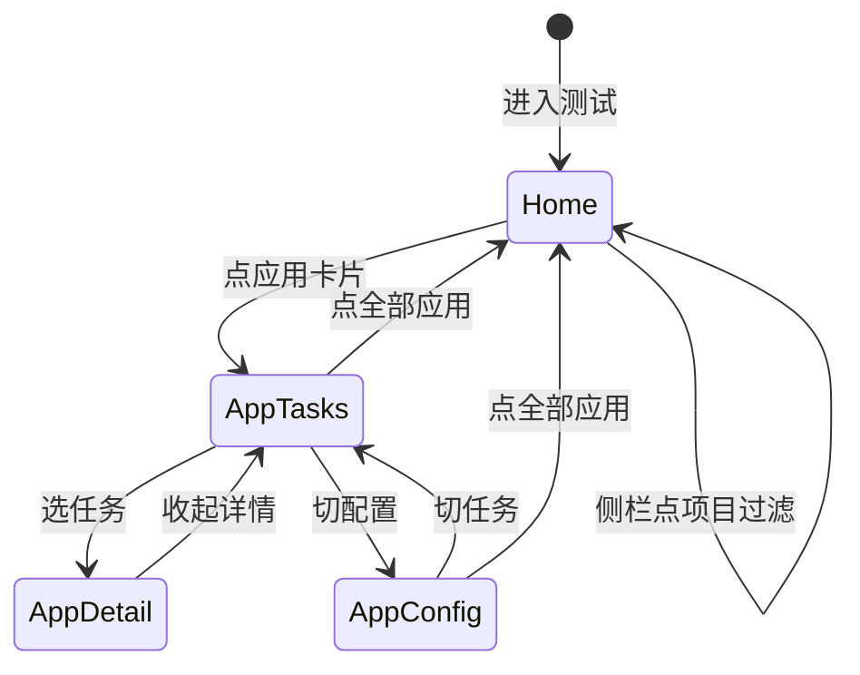

# 测试工作台方案 v3.1（已对齐稿 + 设计图）

> 交互设计图（可切换 4 态）：Cursor Canvas  
> `canvases/testing-workspace-design.canvas.tsx`  
> 在 IDE 中打开该 Canvas 查看线框。

---

## 已锁定决策

1. **顶栏双下拉**：`项目 ▾` + `应用 ▾`（应用列表只含当前项目下的 App）。
2. **侧栏随状态变化**：
   - 全部应用页 → 侧栏展示**项目列表**
   - 已进某个应用 → 侧栏展示**当前应用 + 任务/配置/新建 + 本 App 最近任务**
3. 齿轮**沉底**；任务进度条**窄条**；新建执行只列**在线可执行设备**；任务/配置**同壳**降落差。

---

## 状态机



| 状态 | 路由 | 侧栏中区 | 顶栏 | 主区 |
|------|------|----------|------|------|
| ① 全部应用 | `/testing` | 项目列表 | 标题「测试」 | 项目→应用卡片 |
| ② 应用·任务 | `/testing/:appId?tab=tasks` | 当前应用+快捷+最近任务 | 全部应用 / 项目▾ / 应用▾ + 任务\|配置 | 任务表（窄进度条） |
| ③ 任务详情 | 同上 `?task=` | 同②，高亮对应最近任务 | 追加 `/ 任务短ID` | 左列表+右详情 |
| ④ 应用·配置 | `?tab=config` | 同②，高亮「配置」 | 同②顶栏 | 同壳配置子 Tab |

---

## 顶栏：双下拉交互

```
[全部应用] /  [项目 ▾ 造好物]  [应用 ▾ 造好物移动端]     [任务|配置]  [新建执行] [刷新]
```

- 改**项目**：应用下拉数据源切换为该项目 apps；若当前 app 不属于新项目 → 自动选该项目第一个 app（或清空回①，推荐自动进第一个）。
- 改**应用**：仅跳转 `/testing/:newAppId`，项目不变。
- **全部应用**：回①。

---

## 侧栏线框

### ① 全部应用

```
MiniOrange
[ Agent | 测试 ]
────────────
项目
 · 造好物        ← 可过滤主区
 · 造物相机
 · FakeProj
────────────
（弹性）
────────────
13 台 · Active  ⚙
```

### ②③④ 已进应用

```
MiniOrange
[ Agent | 测试 ]
────────────
当前应用
 造好物 / 造好物移动端
────────────
 · 任务
 · 配置
 · 新建执行
────────────
最近任务
 e2f33992  失败
 ccb57052  失败
 …
────────────
（弹性）
────────────
13 台 · Active  ⚙
```

---

## 主区要点（复述）

- **任务行**：`短ID | 状态 | 迷你进度(~72px) | 2/2·0% | 时间` — 禁止整行大红条。
- **配置面**：与任务面同一顶栏与白卡片壳；子 Tab 权重更低；内嵌，不跳 Settings。
- **新建执行设备**：`only_online` + 至少一条通道在线（adb / ios / clawnode）。

---

## 落地分期（可开干）

**P0**

1. 页脚沉底  
2. 顶栏拆成项目▾ + 应用▾  
3. 任务行窄进度条  
4. 新建执行在线设备过滤  

**P1**

5. 侧栏状态机（①项目列表 / ②③④最近任务+快捷）  
6. 配置同壳样式打磨  

**P2**

7. 切换微动效；侧栏任务状态实时点  

---

若 Canvas 四态线框没有问题，回复「按这个实现」即可开工。
